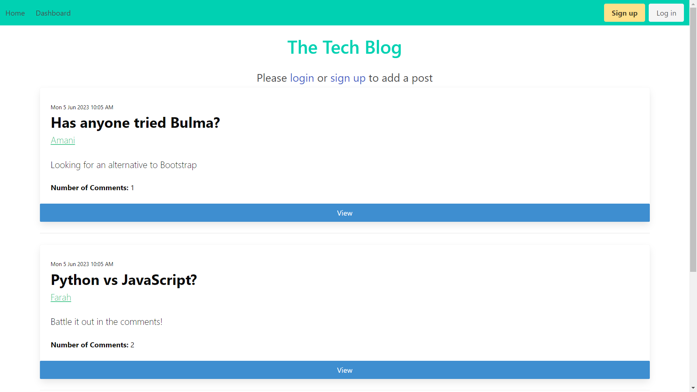
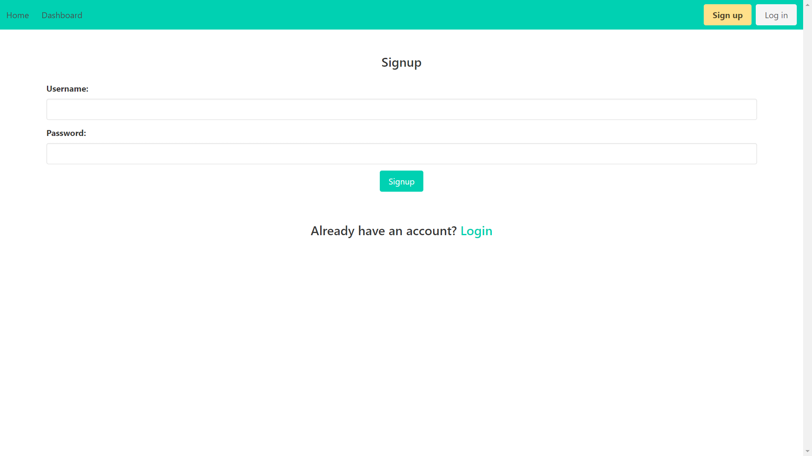
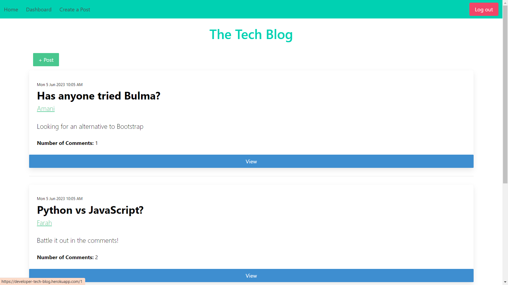
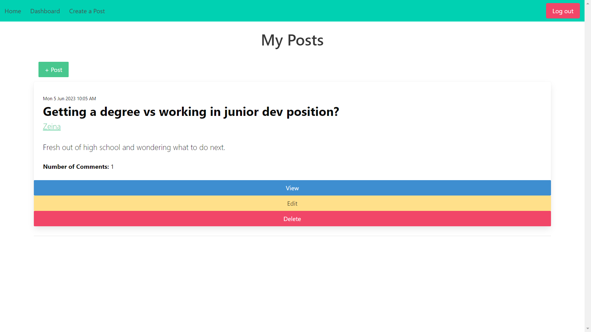
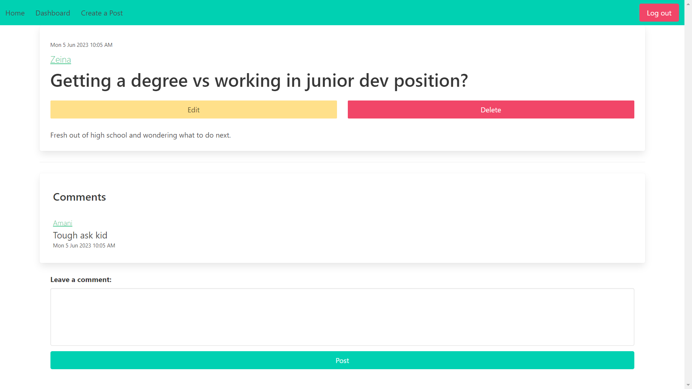
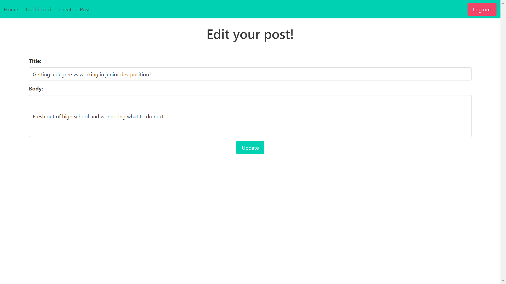
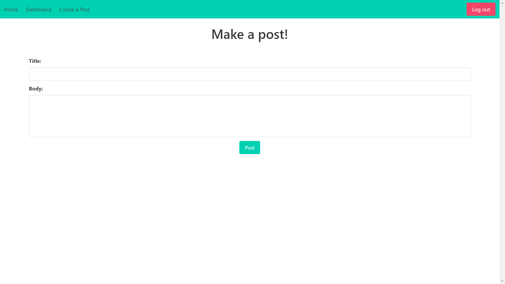
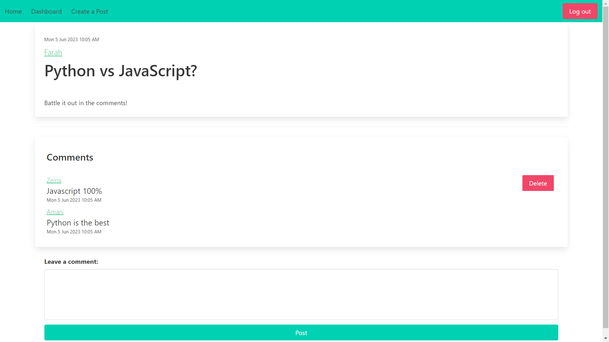

# The Tech Blog

## Description
I wanted to create a CMS-style blog site so that I can publish articles, blog posts, and my thoughts and opinions about tech related issues; and also share these opinions with a community of other developers

## Link to The Tech Blog

https://developer-tech-blog.herokuapp.com/

## Table of contents
- [Installation](#installation)
- [Usage](#usage)
- [License](#license)
- [Contribution](#contribution)
- [Tests](#tests)
- [Questions](#questions)
 

## Installation
N/A

## Usage
Click on the homepage to see a list of all the blogs. Click on the blog to see its full details and all related comments. To create a post or a comment, press on the login or sign up button. Follow the prompts to login/sign up by choosing a username and password. Once you are logged in, you can now create a blog by pressing create a post in the nav bar, or the + post button on the homepage and dashboard. Add a title and body and press post to create a blog. In the dashboard page, now you can see all the blog posts that you have created. You can press the view, edit and delete button according to what you want to do. If you press the edit button, you are taken to a page to edit the post. If you press the delete button, the post will be deleted. Now that you are logged in, if you view any blog, you can now leave a comment by typing a bosdy and pressing post. If you want to delete your comments, you can press the delete button. Also, in the homepage (as well as your dashboard), when logged in, your posts will also have an edit and delete button.

## License
MIT License https://opensource.org/licenses/MIT

    Copyright (c) 2023 zeinahares
    
    Permission is hereby granted, free of charge, to any person obtaining a copy of this software and associated documentation files (the "Software"), to deal in the Software without restriction, including without limitation the rights to use, copy, modify, merge, publish, distribute, sublicense, and/or sell copies of the Software, and to permit persons to whom the Software is furnished to do so, subject to the following conditions:
    
    The above copyright notice and this permission notice shall be included in all copies or substantial portions of the Software.
    
    THE SOFTWARE IS PROVIDED "AS IS", WITHOUT WARRANTY OF ANY KIND, EXPRESS OR IMPLIED, INCLUDING BUT NOT LIMITED TO THE WARRANTIES OF MERCHANTABILITY, FITNESS FOR A PARTICULAR PURPOSE AND NONINFRINGEMENT. IN NO EVENT SHALL THE AUTHORS OR COPYRIGHT HOLDERS BE LIABLE FOR ANY CLAIM, DAMAGES OR OTHER LIABILITY, WHETHER IN AN ACTION OF CONTRACT, TORT OR OTHERWISE, ARISING FROM, OUT OF OR IN CONNECTION WITH THE SOFTWARE OR THE USE OR OTHER DEALINGS IN THE SOFTWARE.

## Contribution
N/A 

## Tests
N/A 
## Questions - 
  
Feel free to reach me for questions at anytime!

  GitHub URL: https://github.com/zeinhares 

  Email Address: zeinahares@gmail.com 
